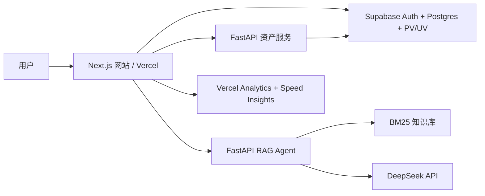

# 美股扫盲导航

面向中文美股新手的 RAG 科普产品：把分散的开户、券商、出入金、税务与合规知识组织成学习路径，并提供基于知识库的问答 Agent 和个人资产看板。

> 仅供科普学习，不构成投资、税务或法律建议。

## 产品亮点

- **新手学习路径**：教程按主题组织，支持全站搜索和章节阅读。
- **RAG 问答 Agent**：对站内教程与指南分块、检索、生成，对荐股、逃税、造假等请求做安全拒答。
- **产品级评测**：分层评估 Retrieval、Faithfulness、Answer Relevance、Safety 和 Routing，设置软/硬发布门禁。
- **可运营化**：邮箱密码登录、注册后直接登录、用户隔离、每日额度、PV/性能统计与管理员指标看板。
- **公网防护**：服务端密钥、CORS、限流、安全响应头和生产环境预检。

## 架构



| 层 | 技术 |
|---|---|
| Web | Next.js 16, React 19, TypeScript, Tailwind CSS |
| Agent | FastAPI, BM25, DeepSeek API, 流式输出 |
| 数据与鉴权 | Supabase Auth, Postgres, RLS/用户隔离 |
| 分析 | Supabase PV/UV 与产品事件看板，Vercel Speed Insights |
| 部署 | Vercel + Railway/Render |

## 评测结果

最近一次真实 API 评测覆盖 62 个案例，包含知识问答、安全拒答、路由和幻觉边界题。

| 指标 | 结果 |
|---|---:|
| 案例 PASS / PARTIAL / FAIL | 62 / 0 / 0 |
| Hit@5 / MRR | 100% / 0.9904 |
| Faithfulness / Relevance | 4.808 / 4.981（5 分制） |
| Judge 幻觉率 | 1.92% |
| 时延 p50 / p95 | 4.04s / 6.74s |

检索相关性目前使用 tags/章节关键词弱标签；nDCG@5 为 0.6212，未达 0.75 软门禁，因此发布结论保持 **CONDITIONAL**，不将该结果包装成人工金标测试。详见 [评测框架](agent/eval/RAG_EVAL_FRAMEWORK.md) 和 [最新分层报告](agent/eval/results/latest_eval_v2_report.md)。

## 本地运行

```bash
npm install
cp .env.example .env.local
npm run agent:install
npm run asset-tracker:install
npm run agent:reindex
npm run asset-tracker:build
npm run services:start
```

默认访问 `http://127.0.0.1:3000`。详细配置见 [公开上线手册](docs/PUBLIC_LAUNCH.md)。

## 部署

这是一个三服务项目，不能只部署前端：

1. 在 Supabase 执行 `supabase/` 与 `asset-tracker/supabase/` 中的建表脚本。
2. 将 `agent/` 部署到 Railway，配置 DeepSeek 密钥和允许的站点域名。
3. 将 `asset-tracker/` 部署到 Render，配置 Postgres、会话密钥和允许的站点域名。
4. 将根目录导入 Vercel，配置 `.env.example` 中的生产变量后发布。

Vercel 构建会先执行生产预检；鉴权、数据库或后端地址不完整时会直接拒绝发布。

## 仓库说明

- PNG/JPG 教程原图仅保留在本地；仓库与线上站点使用由 `npm run optimize:images` 生成的 WebP 图片。
- `.env*`、本地用户数据、虚拟环境与原始评测记录不会提交。
- 内容、机构规则和税务信息可能随时变化，使用者应以官方最新规则为准。
